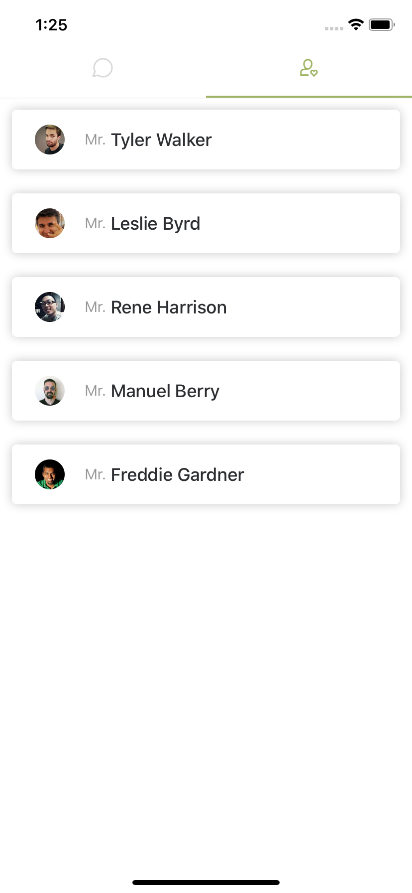

# TinderSample
## Description
Just a sample Tinder-like application

## Screenshots
 &nbsp; 

## Dependencies
All listed in package.json, some significant libraries and API can be mentioned below:
### API
- [randomuser.me](https://randomuser.me/documentation)
### Carousel
- [react-native-deck-swiper](https://github.com/alexbrillant/react-native-deck-swiper)
### Local storage
- [redux-persist](https://github.com/rt2zz/redux-persist)
- [async-storage](https://github.com/react-native-community/async-storage)

## Responsiveness
- The author did not have enough time to support for responsiveness. Try this on iPhone 11 to have the best experience

## Localize
### Languages
- English

## TODO
- A better alert for no network.
- Exception handler for API's failure.
- Option to remove favorite profiles.
- Implement the carousel without using `react-native-deck-swiper`.
